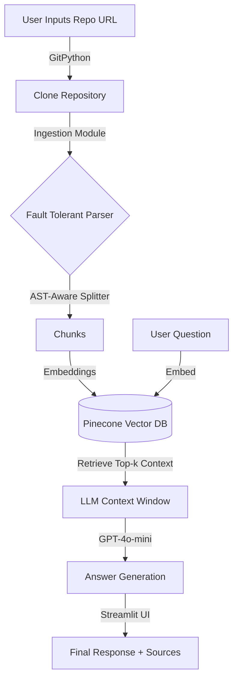

# 🧠 RepoParser
> **"Talk to your Codebase."**  
> An interactive RAG (Retrieval-Augmented Generation) tool that lets you chat with any GitHub repository.


## 🚀 What is RepoParser?

**RepoParser** is a sophisticated developer tool that allows you to perform **Deep Code Analysis** on any public GitHub repository. Instead of manually searching through thousands of lines of code, you can simply paste a URL and ask questions like:
- *"How is authentication implemented?"*
- *"Where is the retry logic for API calls?"*
- *"Explain the class hierarchy in the utils module."*

It goes beyond simple text search by using **AST-Aware Chunking**, ensuring that the AI understands the semantic structure of your code (classes, functions) rather than just treating it as raw text.

---

## ✨ Unique Features

### 1. 🐍 AST-Aware Intelligence
Most RAG tools blindly split text every N characters, often breaking code in the middle of a function. **RepoParser** uses the `RecursiveCharacterTextSplitter.from_language(Language.PYTHON)`, which respects the Abstract Syntax Tree (AST).
- **Result:** Context chunks preserve complete functions and classes, leading to significantly more accurate answers.

### 2. 🛡️ Fault-Tolerant Ingestion
Real-world repositories are messy. RepoParser includes a custom **Defensive Ingestion Layer**:
- **Binary Skipping:** Automatically detects and skips non-text files that would confuse the LLM.
- **Encoding Safety:** gracefully handles encoding errors (UnicodeDecodeError) so a single bad file doesn't crash the pipeline.

### 3. ⚡ LCEL-Powered "Brain"
Built on **LangChain Expression Language (LCEL)**, the RAG chain is optimized for speed and transparency. It isn't a black box; it's a composable pipeline of:
`Retrieval` -> `Prompt` -> `LLM` -> `Parser`.

### 4. 🔍 Validated Sources
Trust but verify. Every answer includes **direct citations** to the source files used to generate the response, so you can deep-dive into the code yourself.

---

## 🏗️ Architecture



---

## 🛠️ Tech Stack

- **Framework**: Python 3.12+
- **Orchestration**: LangChain (LCEL)
- **Vector Database**: Pinecone
- **LLM**: OpenAI GPT-4o-mini (Temperature 0 for precision)
- **Interface**: Streamlit
- **Utilities**: GitPython, Python-Dotenv

---

## ⚡ Getting Started

### Prerequisites
- Python 3.10 or higher
- An OpenAI API Key
- A Pinecone API Key

### 1. Clone this Repo
```bash
git clone https://github.com/yourusername/RepoParser.git
cd RepoParser/RepoChat
```

### 2. Install Dependencies
```bash
pip install -r requirements.txt
```

### 3. Configure Environment
Create a `.env` file in the root directory:
```bash
touch .env
```
Add your API keys:
```ini
OPENAI_API_KEY=sk-proj-...
PINECONE_API_KEY=pc-...
PINECONE_ENV=us-east-1  # Verify your region in Pinecone console
PINECONE_INDEX_NAME=repo-chat
```

### 4. Run the App
```bash
streamlit run app.py
```

---

## 📂 Project Structure

```bash
RepoChat/
├── app.py                 # 🖥️ Main Streamlit Interface
├── requirements.txt       # 📦 Dependencies
├── .env                   # 🔑 API Keys (Not committed)
└── src/
    ├── __init__.py
    ├── ingestion.py       # 🚜 The Harvester (Cloning & AST Splitting)
    ├── vector_store.py    # 📚 The Library (Pinecone Management)
    └── rag_chain.py       # 🧠 The Brain (LCEL Pipeline)
```

---

## 🔮 Roadmap
- [ ] Support for TypeScript/JavaScript AST parsing.
- [ ] "Deep Mode" for multi-hop reasoning across files.
- [ ] Local LLM support (Ollama).

---
*Built with ❤️ by Aaryan*
